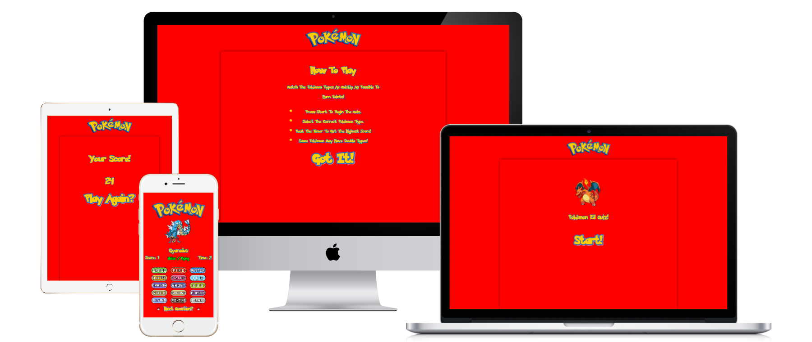
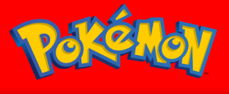

# Pokémon 151 Quiz

The Pokémon 151 Quiz is designed for fans and newcomers alike who want to test their knowledge or learn more about the original Generation 1 Pokémon. This quiz specifically focuses on the 151 Pokémon from the Kanto region, challenging players to identify their types quickly and accurately.

Whether you're a seasoned Pokémon Trainer aiming to sharpen your skills or a beginner looking to learn more about Pokémon types, this game offers a fun and interactive way to engage with the original Pokémon lineup. With its fast-paced format, this quiz is both a learning tool and an exciting challenge that encourages players to improve with each attempt.

By the end of the game, players not only get to see their score but also have the chance to dive back in and aim for a higher score, making it perfect for replayability and continuous learning.

#

## Features
- Gen 1 Pokémon Quiz: Test your knowledge on the original 151 Pokémon from the Kanto region, trying to identify each Pokémon's type.

- [Type-Based Quiz Mechanics](assets/images/readme_images/type_mechanic.png):

    - Each Pokémon in the quiz has one or more types, as found in the original games.
    - Special handling is implemented for certain Pokémon whose types differ in Gen 1 compared to later generations (e.g., Magnemite and Magneton appear only as Electric types, not Steel).
    - Double-type Pokémon require both types to be selected for a correct answer, adding an extra challenge for seasoned fans.
    - Randomized Pokémon Selection: Pokémon appear in a random order, with each Pokémon appearing only once per game to avoid repetition.

- [Timer](assets/images/readme_images/time_previewt.png) and [Scoring System](assets/images/readme_images/score_preview.png): Race against the clock with a countdown timer. Earn points for each correct answer, and see your final score when the time is up.

- [Visual Feedback](assets/images/readme_images/red_green_grey.png): Immediate visual feedback indicates correct and incorrect answers, helping players learn and remember the types.

- [Preloaded Pokémon Data](assets/images/readme_images/poke_api_preview.png): The game preloads all Pokémon data to reduce lag, ensuring smooth gameplay and preventing potential API hang-ups.

## Gameplay
1. Start: Begin by pressing the start button on the home screen.
2. Tutorial: View the tutorial screen for an overview of game rules (optional).
3. Game: Identify the Pokémon’s type(s) as quickly as possible. Each Pokémon may have one or two types, so be attentive!
4. Timer: A 45-second timer counts down during gameplay.
5. Score: Each correct answer increases the score by one point.
6. End: When time runs out, the score screen shows the final score with an option to restart the quiz.

## Technologies Used
- HTML: For the structure of the game screens.
- CSS: For styling and creating a responsive design.
- JavaScript: For handling the game logic, interactions, and API fetching.
- PokéAPI: Provides data for Pokémon names, types, and images.
## Future Enhancements
- Expanded Pokémon Generations: Add support for more generations beyond Generation 1.
- Leaderboard: Store and display high scores across sessions.
-Difficulty Levels: Add different game modes, such as an easy mode with no timer or a hard mode with less time.
- More Feedback: Add animations or sound effects to enhance user experience.

####

# Testing

- __W3C Validator__
    - [HTML](assets/images/readme_images/wc3_html.png) - Passed with 1 warning for disable zoom (for smoother gameplay) 2 error for empty img src used for API fetch.

    - [CSS](assets/images/readme_images/wc3_css.png) - Passed no errors.

- __JavaScript Validator__
    - [JavaScript](assets/images/readme_images/jshint.png) - Passed with one warning for ternary operator.

- __Lighthouse__
    - [Desktop](assets/images/readme_images/desktop_lighthouse.png)
    - [Mobile](assets/images/readme_images/lighthouse_phone.png)

### Tested Devices (Gameplay)

- Desktop - No issues

- iPhone 14 PRO - No issues

## Unfixed Bugs

API hang-ups have occasionally occurred, causing gameplay interruptions. To address this, I optimized the application by preloading all Pokémon data at the start. This approach significantly reduces lag and minimizes the likelihood of the API getting stuck during gameplay, resulting in a smoother and more reliable experience.
 
### Credits

- ChatGPT: Assisted with generating code snippets and improving the project structure.

- [PokéAPI](https://pokeapi.co/): for providing the Pokémon data.

- Help with API fetching from: [Bro Code on YouTube](https://www.youtube.com/watch?v=37vxWr0WgQk)

####

### [The Pokémon Company & Wikimedia](https://commons.wikimedia.org/wiki/File:International_Pokémon_logo.svg ): For Pokémon Logo

####

#

### Type Logos taken from: [Pokémon Fandom](https://pokemon.fandom.com/f/p/4400000000003871559)
####

#

### [Font Meme](https://fontmeme.com/pokemon-font/): For providing fonts
####

#

### [Uxwing](https://uxwing.com/pokemon-icon/): Provided Pokéball Icons
####

#

